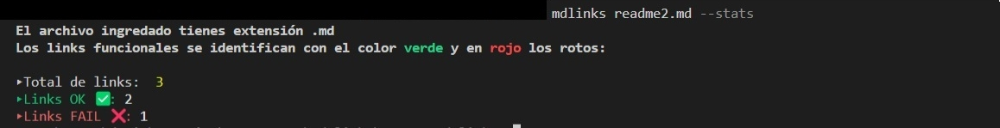
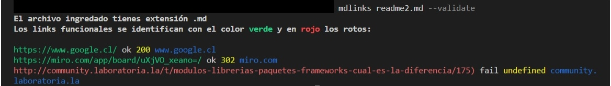
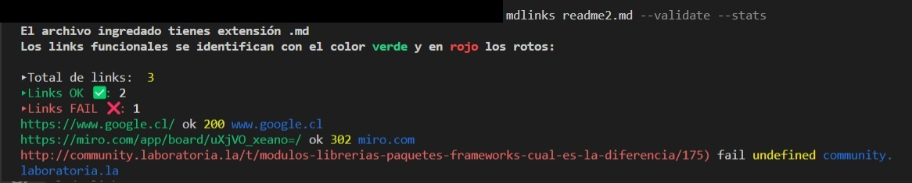

# Markdown Links

## Índice

* [1. Sobre el módulo](#1-sobre-el-módulo)
* [2. Instalación](#2-instalación)
* [3. Cómo usar](#3-cómo-usar)

***

## 1. Sobre el módulo
md-links-danielaAlcala es una aplicación que permite verificar el estado de los links contenidos en archivos md de manera fácil y rápida, con la opción de ver stats básicas como el total de links encontrados, links funcionales y links rotos, además de poder desplegar una lista completa de links que indica de forma gráfica y sencilla el estado de cada uno.


## 2. Instalación
Para instalar, sólo debes ejecutar el siguiente comando en tu terminal:

`npm install md-links-danielaAlcala`

## 3. Cómo usar
Una vez instalada, puedes llamar a la aplicación como 'mdlinks', agregando la ruta del archivo o directorio a revisar y especificando si quieres ver --stats, --validate o ambos.

### Ejemplos:
```sh
mdlinks ./some/example.md --stats
mdlinks ./some/example.md --validate
mdlinks ./some/example.md --stats --validate
```

Si falta alguno de los datos, recibirás un mensaje de aviso y tendrás que iniciar la aplicación nuevamente, ingresando lo que faltaba.

### Un correcto uso se ve así:

- **--stats**:
Al colocar --stats se mostrará el total de  links, cantidad de links válidos en verde y cantidad de liks inválidos en rojo. 



- **--validate**:
Al colocar --validate se mostrará los links válidos en verde y los liks inválidos en rojo. 



- **--validate --stats**
Si se colocan ambas opciones --validate --stats se mostrara toda la informacion: links válidos en verde, links inválidos en rojo y la estadística.




